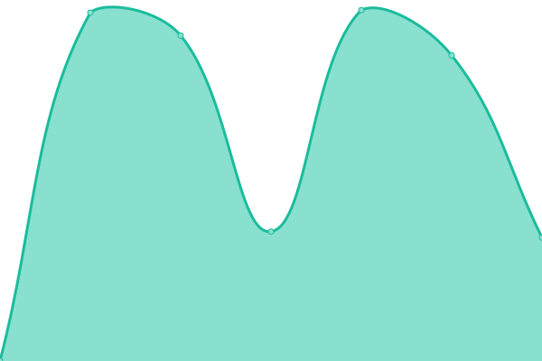

# [📈 Live Status](https://status.momento.group): <!--live status--> **🟧 Partial outage**

This repository contains the open-source uptime monitor and status page for [suritptyltd](https://status.momento.group), powered by [Upptime](https://github.com/upptime/upptime).

With [Upptime](https://upptime.js.org), you can get your own unlimited and free uptime monitor and status page, powered entirely by a GitHub repository. We use [Issues](https://github.com/suritptyltd/mhgupptime/issues) as incident reports, [Actions](https://github.com/suritptyltd/mhgupptime/actions) as uptime monitors, and [Pages](https://status.momento.group) for the status page.

<!--start: status pages-->
<!-- This summary is generated by Upptime (https://github.com/upptime/upptime) -->
<!-- Do not edit this manually, your changes will be overwritten -->
<!-- prettier-ignore -->
| URL | Status | History | Response Time | Uptime |
| --- | ------ | ------- | ------------- | ------ |
|  [Office 365](https://office.com) | 🟩 Up | [office-365.yml](https://github.com/suritptyltd/mhgupptime/commits/HEAD/history/office-365.yml) | 

 169ms
     
 | 

<a href="https://status.momento.group/history/office-365">100.00%</a>
    

|  [Momento Hospitality](https://momentohospitality.com.au) | 🟩 Up | [momento-hospitality.yml](https://github.com/suritptyltd/mhgupptime/commits/HEAD/history/momento-hospitality.yml) | 

 1480ms
     
 | 

<a href="https://status.momento.group/history/momento-hospitality">100.00%</a>
    

|  [Bella Vista Hotel](https://bellavistahotel.com.au) | 🟩 Up | [bella-vista-hotel.yml](https://github.com/suritptyltd/mhgupptime/commits/HEAD/history/bella-vista-hotel.yml) | 

 2315ms
     
 | 

<a href="https://status.momento.group/history/bella-vista-hotel">100.00%</a>
    

|  [Mullane's Hotel](https://mullanes.com.au) | 🟩 Up | [mullane-s-hotel.yml](https://github.com/suritptyltd/mhgupptime/commits/HEAD/history/mullane-s-hotel.yml) | 

 1334ms
     
 | 

<a href="https://status.momento.group/history/mullane-s-hotel">100.00%</a>
    

|  [Hillside Hotel](https://hillsidehotel.com.au) | 🟩 Up | [hillside-hotel.yml](https://github.com/suritptyltd/mhgupptime/commits/HEAD/history/hillside-hotel.yml) | 

 2435ms
     
 | 

<a href="https://status.momento.group/history/hillside-hotel">100.00%</a>
    

|  [Momento Hospitality](https://momentohospitality.com.au) | 🟩 Up | [momento-hospitality.yml](https://github.com/suritptyltd/mhgupptime/commits/HEAD/history/momento-hospitality.yml) | 

 1480ms
     
 | 

<a href="https://status.momento.group/history/momento-hospitality">100.00%</a>
    

|  [Momento Hospitality](https://momentohospitality.com.au) | 🟩 Up | [momento-hospitality.yml](https://github.com/suritptyltd/mhgupptime/commits/HEAD/history/momento-hospitality.yml) | 

 1480ms
     
 | 

<a href="https://status.momento.group/history/momento-hospitality">100.00%</a>
    

|  [Test Broken Site](https://thissitedoesnotexist.koj.co) | 🟥 Down | [test-broken-site.yml](https://github.com/suritptyltd/mhgupptime/commits/HEAD/history/test-broken-site.yml) | 

 0ms
     
 | 

<a href="https://status.momento.group/history/test-broken-site">100.00%</a>
    

<!--end: status pages-->

[**Visit our status website →**](https://status.momento.group)

## 📄 License

- Powered by: [Upptime](https://github.com/upptime/upptime)
- Code: [MIT](./LICENSE) © [suritptyltd](https://status.momento.group)
- Data in the `./history` directory: [Open Database License](https://opendatacommons.org/licenses/odbl/1-0/)
