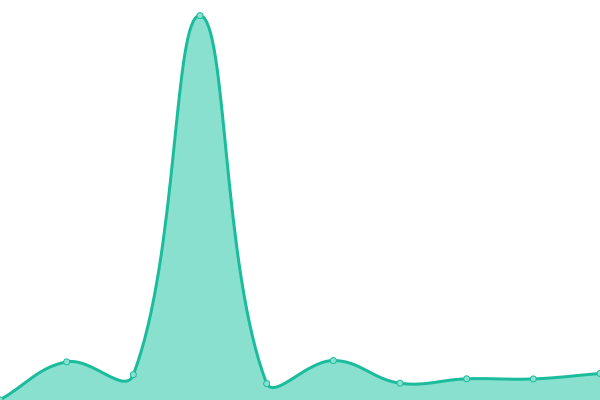
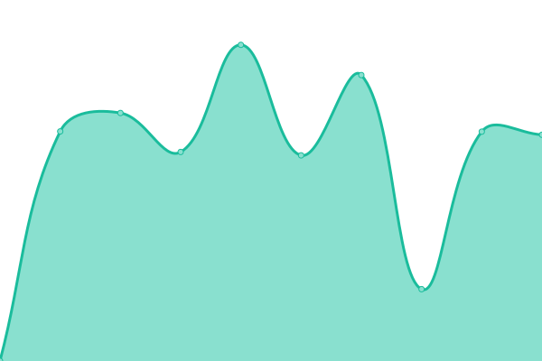
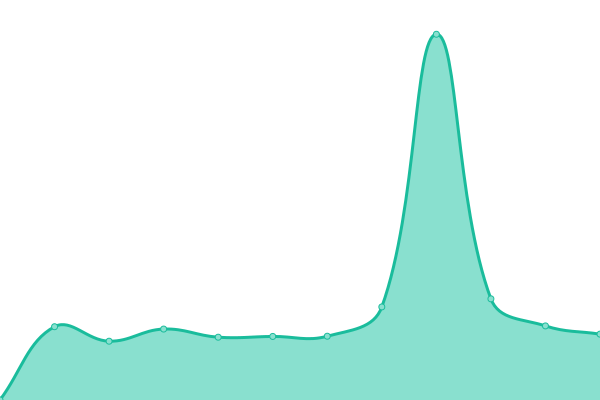
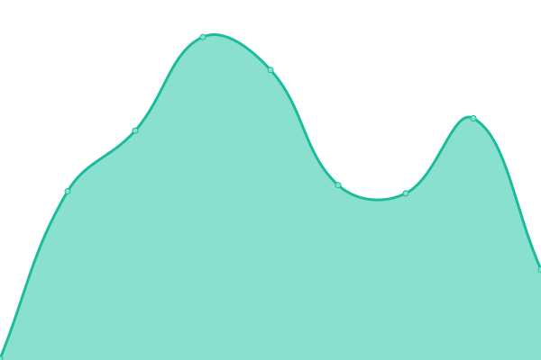

# [📈 Live Status](https://status.momento.group): <!--live status--> **🟧 Partial outage**

This repository contains the open-source uptime monitor and status page for [suritptyltd](https://status.momento.group), powered by [Upptime](https://github.com/upptime/upptime).

With [Upptime](https://upptime.js.org), you can get your own unlimited and free uptime monitor and status page, powered entirely by a GitHub repository. We use [Issues](https://github.com/suritptyltd/mhgupptime/issues) as incident reports, [Actions](https://github.com/suritptyltd/mhgupptime/actions) as uptime monitors, and [Pages](https://status.momento.group) for the status page.

<!--start: status pages-->
<!-- This summary is generated by Upptime (https://github.com/upptime/upptime) -->
<!-- Do not edit this manually, your changes will be overwritten -->
<!-- prettier-ignore -->
| URL | Status | History | Response Time | Uptime |
| --- | ------ | ------- | ------------- | ------ |
|  [office.com](https://office.com) | 🟩 Up | [office-com.yml](https://github.com/suritptyltd/mhgupptime/commits/HEAD/history/office-com.yml) | 

 322ms
     
 | 

<a href="https://status.momento.group/history/office-com">100.00%</a>
    

|  [momentohospitality.com.au](https://momentohospitality.com.au) | 🟥 Down | [momentohospitality-com-au.yml](https://github.com/suritptyltd/mhgupptime/commits/HEAD/history/momentohospitality-com-au.yml) | 

 2048ms
     
 | 

<a href="https://status.momento.group/history/momentohospitality-com-au">99.96%</a>
    

|  [bellavistahotel.com.au](https://bellavistahotel.com.au) | 🟥 Down | [bellavistahotel-com-au.yml](https://github.com/suritptyltd/mhgupptime/commits/HEAD/history/bellavistahotel-com-au.yml) | 

 2179ms
     
 | 

<a href="https://status.momento.group/history/bellavistahotel-com-au">99.96%</a>
    

|  [mullanes.com.au](https://mullanes.com.au) | 🟩 Up | [mullanes-com-au.yml](https://github.com/suritptyltd/mhgupptime/commits/HEAD/history/mullanes-com-au.yml) | 

 1234ms
     
 | 

<a href="https://status.momento.group/history/mullanes-com-au">100.00%</a>
    

|  [hillsidehotel.com.au](https://hillsidehotel.com.au) | 🟥 Down | [hillsidehotel-com-au.yml](https://github.com/suritptyltd/mhgupptime/commits/HEAD/history/hillsidehotel-com-au.yml) | 

 2195ms
     
 | 

<a href="https://status.momento.group/history/hillsidehotel-com-au">99.97%</a>
    

|  [thedukeofdural.com.au](https://thedukeofdural.com.au) | 🟩 Up | [thedukeofdural-com-au.yml](https://github.com/suritptyltd/mhgupptime/commits/HEAD/history/thedukeofdural-com-au.yml) | 

 2374ms
     
 | 

<a href="https://status.momento.group/history/thedukeofdural-com-au">100.00%</a>
    

|  [thegovernorhotel.com.au](https://thegovernorhotel.com.au) | 🟥 Down | [thegovernorhotel-com-au.yml](https://github.com/suritptyltd/mhgupptime/commits/HEAD/history/thegovernorhotel-com-au.yml) | 

 2365ms
     
 | 

<a href="https://status.momento.group/history/thegovernorhotel-com-au">99.97%</a>
    

|  [learnhospo.com.au](https://learnhospo.com.au) | 🟩 Up | [learnhospo-com-au.yml](https://github.com/suritptyltd/mhgupptime/commits/HEAD/history/learnhospo-com-au.yml) | 

 2170ms
     
 | 

<a href="https://status.momento.group/history/learnhospo-com-au">100.00%</a>
    

|  [bangbangdrinks.com](https://www.bangbangdrinks.com) | 🟥 Down | [bangbangdrinks-com.yml](https://github.com/suritptyltd/mhgupptime/commits/HEAD/history/bangbangdrinks-com.yml) | 

 1353ms
     
 | 

<a href="https://status.momento.group/history/bangbangdrinks-com">99.98%</a>
    

|  [thedrinkstore.com.au](https://www.thedrinkstore.com.au) | 🟩 Up | [thedrinkstore-com-au.yml](https://github.com/suritptyltd/mhgupptime/commits/HEAD/history/thedrinkstore-com-au.yml) | 

 159ms
     
 | 

<a href="https://status.momento.group/history/thedrinkstore-com-au">100.00%</a>
    

|  [origincoffeeliqueur.com](https://origincoffeeliqueur.com) | 🟩 Up | [origincoffeeliqueur-com.yml](https://github.com/suritptyltd/mhgupptime/commits/HEAD/history/origincoffeeliqueur-com.yml) | 

 1683ms
     
 | 

<a href="https://status.momento.group/history/origincoffeeliqueur-com">100.00%</a>
    

|  HQ Internet | 🟩 Up | [hq-internet.yml](https://github.com/suritptyltd/mhgupptime/commits/HEAD/history/hq-internet.yml) | 

 0ms
     
 | 

<a href="https://status.momento.group/history/hq-internet">100.00%</a>
    

|  Bella Internet | 🟩 Up | [bella-internet.yml](https://github.com/suritptyltd/mhgupptime/commits/HEAD/history/bella-internet.yml) | 

 0ms
     
 | 

<a href="https://status.momento.group/history/bella-internet">100.00%</a>
    

|  Mullane's Internet | 🟩 Up | [mullane-s-internet.yml](https://github.com/suritptyltd/mhgupptime/commits/HEAD/history/mullane-s-internet.yml) | 

 0ms
     
 | 

<a href="https://status.momento.group/history/mullane-s-internet">100.00%</a>
    

|  Duke Internet | 🟩 Up | [duke-internet.yml](https://github.com/suritptyltd/mhgupptime/commits/HEAD/history/duke-internet.yml) | 

 182ms
     
 | 

<a href="https://status.momento.group/history/duke-internet">100.00%</a>
    

|  Hillside Internet | 🟩 Up | [hillside-internet.yml](https://github.com/suritptyltd/mhgupptime/commits/HEAD/history/hillside-internet.yml) | 

 0ms
     
 | 

<a href="https://status.momento.group/history/hillside-internet">100.00%</a>
    

|  Governor Internet | 🟩 Up | [governor-internet.yml](https://github.com/suritptyltd/mhgupptime/commits/HEAD/history/governor-internet.yml) | 

 0ms
     
 | 

<a href="https://status.momento.group/history/governor-internet">100.00%</a>
    

|  [Test Broken Site](https://thissitedoesnotexist.koj.co) | 🟥 Down | [test-broken-site.yml](https://github.com/suritptyltd/mhgupptime/commits/HEAD/history/test-broken-site.yml) | 

 0ms
     
 | 

<a href="https://status.momento.group/history/test-broken-site">100.00%</a>
    

<!--end: status pages-->

[**Visit our status website →**](https://status.momento.group)

## 📄 License

- Powered by: [Upptime](https://github.com/upptime/upptime)
- Code: [MIT](./LICENSE) © [suritptyltd](https://status.momento.group)
- Data in the `./history` directory: [Open Database License](https://opendatacommons.org/licenses/odbl/1-0/)
